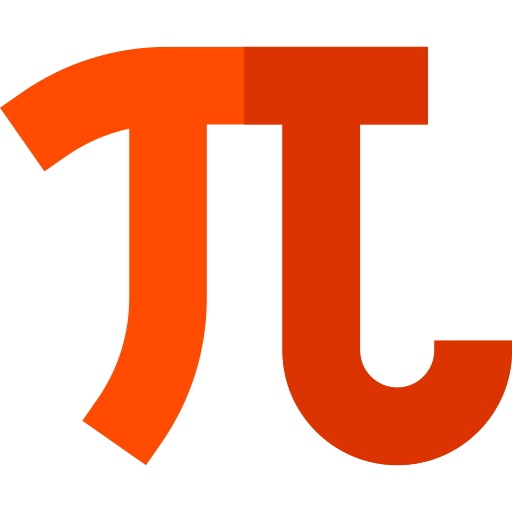

## 3.14159.mov

Just a simple website to random play a video of Pi song.

There is no meaning, but many things in this world are meaningless.

## License

The code in this repository, unless otherwise noted, is under the terms of both the [Anti 996](https://github.com/996icu/996.ICU/blob/master/LICENSE) License and the [Apache License (Version 2.0)](LICENSE).

And, You agree You proudly boast your ability to recite pi.
